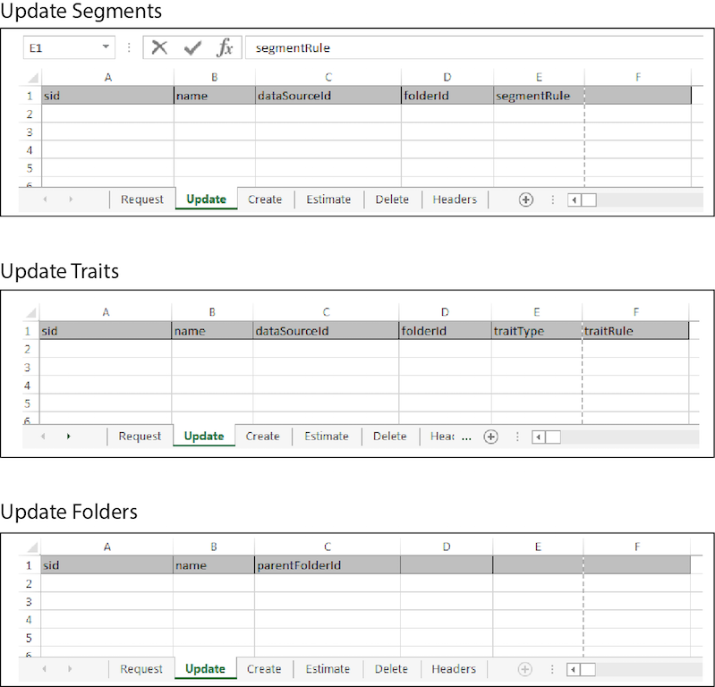

# Massenaktualisierungen{#bulk-updates}

Mit einer Massenaktualisierung können Sie mehrere Segmente, Eigenschaften, Modelle, Datenquellen und Segment- oder Trait-Ordnerelemente in einem einzigen Vorgang bearbeiten. Befolgen Sie diese Anweisungen, um Massenaktualisierungen durchzuführen.

>[!IMPORTANT]
>
>Die Tools für die Massenverwaltung sind kein offiziell unterstütztes Adobe-Angebot. Die Fehlerbehebung und der Support über die Kundenunterstützung werden von Fall zu Fall durchgeführt.

<!-- 

t_bulk_updates.xml

 -->

>[!NOTE]
>
>[RBAC-Gruppenberechtigungen](../../features/administration/administration-overview.md), die in der [!DNL Audience Manager]-Benutzeroberfläche zugewiesen sind, werden in der [!UICONTROL Bulk Management Tools] berücksichtigt.

Um Massenaktualisierungen vorzunehmen, öffnen Sie das [!UICONTROL Bulk Management Tools] Arbeitsblatt und:

1. Klicken Sie auf die Registerkarte **[!UICONTROL Headers]** und kopieren Sie die Aktualisierungskopfzeilen für das Element, das Sie bearbeiten möchten.
2. Klicken Sie auf die Registerkarte **[!UICONTROL Update]** .
3. Fügen Sie die Aktualisierungskopfzeilen in die erste Zeile des Aktualisierungsarbeitsblatts ein. Beachten Sie Folgendes:

   * Beim Aktualisieren eines Ordners sind alle Kopfzeilen erforderlich.
   * Beim Aktualisieren von Segmenten oder Eigenschaften benötigen Sie nur die Segment-ID (SID) und das Header-Element, das geändert werden muss. Löschen Sie nicht verwendete Header.

4. Fügen Sie die Daten, die Sie ändern möchten, ein, oder geben Sie sie anhand der Kopfzeilenbeschriftung in eine entsprechende Spalte ein.
5. Klicken Sie in der Symbolleiste des Arbeitsblatts auf eine Aktualisierungsschaltfläche, die der        Element, das Sie aktualisieren.
Diese Aktion öffnet das Dialogfeld [!UICONTROL Account Information].

6. Geben Sie die erforderlichen [Anmeldeinformationen“ ein ](../../reference/bulk-management-tools/bulk-management-intro.md#auth-reqs) klicken Sie auf **[!UICONTROL Submit]**.

   Das Arbeitsblatt erstellt eine [!UICONTROL Results]. Die Spalte [!UICONTROL Results] gibt die JSON-Antwort für einen erfolgreichen Vorgang zurück. Beispiele finden Sie in [REST](../../api/rest-api-main/rest-api-main.md)APIs). Vor der Dateneingabe sollte Ihr Massenaktualisierungsarbeitsblatt wie folgt aussehen:

Wenn Ihre Massenaktualisierung einen Fehler zurückgibt oder fehlschlägt, finden Sie weitere Informationen unter [Fehlerbehebung für Tools für die Massenverwaltung](../../reference/bulk-management-tools/bulk-troubleshooting.md).
