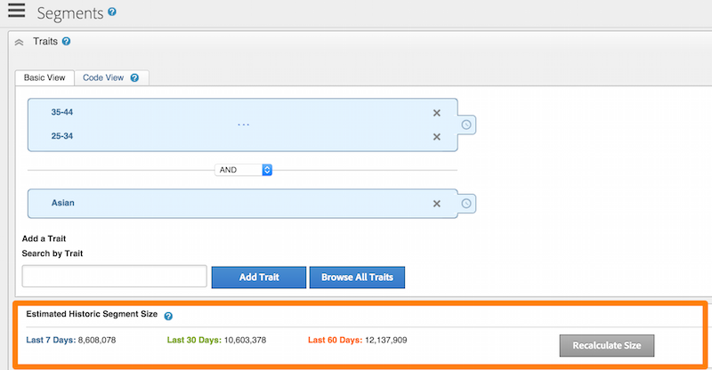
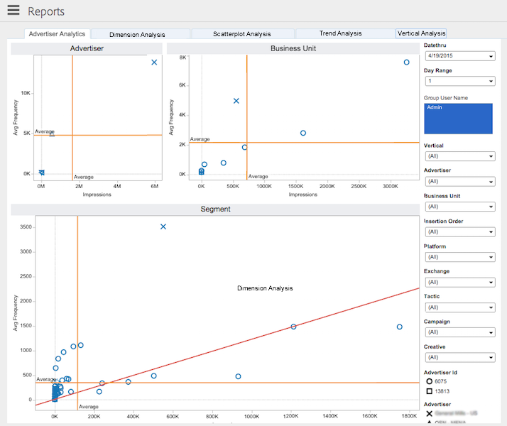

# Datenverarbeitungskomponenten{#data-processing-components}

Zu den Datenverarbeitungskomponenten gehören Hadoop, Snowflake, SOLR und Tableau.

<!-- 

c_comproc.xml

 -->

Audience Manager verwendet die folgenden Komponenten zur Datenverarbeitung:

## Hadoop {#hadoop}

In [!DNL Audience Manager] ist Hadoop die Hauptdatenbank, die alles enthält, was [!DNL Audience Manager] über einen Benutzer weiß. Wenn beispielsweise die [Profil-Cache-Server](../../reference/system-components/components-data-collection.md) Protokolldateien mit Benutzerdaten erstellen, werden diese Daten zur Datenspeicherung an Hadoop gesendet. Weitere wichtige Hadoop-Elemente sind:

* **Hive:** Ein Data Warehouse für Hadoop. Hive verwaltet Ad-hoc-Abfragen an den in Hadoop gespeicherten Daten.

* **HBase:** Eine sehr große Hadoop-Datenbank. Es verarbeitet und verwaltet eingehende und ausgehende Daten, Eigenschaftsregeln, algorithmische Modellierungsinformationen und führt viele andere Funktionen zum Speichern und Verschieben von Daten auf verschiedene Systeme aus.

Kunden haben keinen direkten Zugriff auf diese Systeme. Kunden arbeiten jedoch indirekt mit ihnen, da diese Komponenten wichtige Daten über ihre Site-Besucher speichern.

## Snowflake {#snowflake}

 Snowflakeis ist eine riesige Cloud-Datenbank. Es stellt Daten für viele der Dashboard-Diagramme und die zugehörigen Textfelder bereit, die die Änderung in % für jedes Element im Diagramm anzeigen. Wenn Sie [!DNL Audience Manager] verwenden und sich die Dashboard-Berichte ansehen, interagieren Sie mit den von [!UICONTROL Snowflake] bereitgestellten Daten.

Dies ist keineswegs eine umfassende Liste, aber einige häufige Dashboard-Berichte, für die [!UICONTROL Snowflake] verantwortlich ist, enthalten Folgendes:

* [Täglicher Bericht zur Eigenschaftsvarianz](/help/using/reporting/audience-optimization-reports/daily-trait-variation-report.md)
* Alle Überschneidungsberichte (Informationen zu den Überschneidungsberichten finden Sie im Abschnitt [Interaktive Berichte](/help/using/reporting/dynamic-reports/dynamic-reports.md)).
* [Bericht zu nicht verwendeten Signalen](/help/using/reporting/dynamic-reports/unused-signals.md)

## SOLR {#solr}

SOLR ist eine Open-Source-Datenbank und ein Serversystem von Apache. Es bietet robuste und schnelle Suchfunktionen für unsere großen Datensätze. Als [!DNL Audience Manager]-Kunde können Sie SOLR in Aktion sehen, wenn Sie Segmente erstellen. Er stellt Daten für den Bericht [!UICONTROL Estimated Historic Segment Size] bereit. SOLR ist aufgrund seiner Geschwindigkeit ideal für diese Rolle. SOLR kann beispielsweise die Daten der historischen Größe aktualisieren, wenn Sie Regeln erstellen und neue Eigenschaften zu einem Segment hinzufügen.

## Tableau {#tableau}

[!DNL Audience Manager] verwendet   Tableauto-Anzeigedaten in den  [interaktiven ](../../reporting/dynamic-reports/dynamic-reports.md#interactive-and-overlap-reports) Berichten und den  [Audience Optimizationen-Berichten](../../reporting/audience-optimization-reports/audience-optimization-reports.md). Die interaktiven Berichte zeigen Leistungs- und Überlagerungsdaten für Eigenschaften und Segmente an. Statt in Spalten und Zeilen angeordnete Zahlen zu verwenden, geben sie Daten mit unterschiedlichen Formen, Farben und Größen zurück. Darüber hinaus können Sie einzelne oder Gruppen von Datenpunkten auswählen und im Drilldown-Verfahren die Berichtsergebnisse aufschlüsseln, um weitere Details zu erhalten. Diese Visualisierungstechniken und die Berichtsinteraktivität erleichtern das Verständnis zahlreicher numerischer Daten.

