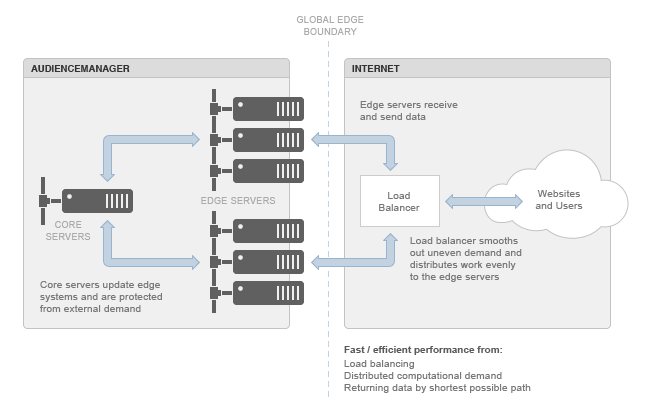

# Grundlegendes zum Edge-Rechenzentrum{#understanding-the-edge-data-center}

Audience Manager verwendet verteilte Edge-Computing-Topologien, um die Anforderungen an unsere Systeme durch externe Quellen zu erfüllen.

## Grundlagen zum Edge-Rechenzentrum {#edge-data-center-basics}

<!-- 

c_compedge.xml

 -->

Edge Computing bietet eine verbesserte Leistung als Reaktion auf diffuse, Internet-weite Anforderungen, da der „Edge“ selbst eine globale Grenze darstellt. Das bedeutet, [!DNL Audience Manager] die Verarbeitung dynamisch den Nachfragequellen am nächsten platziert und Daten auf dem kürzestmöglichen Pfad zurückgibt. Edge Computing trägt zur Aufrechterhaltung der Site-Performance bei, wodurch wiederum das Benutzererlebnis auf Ihrer Website erhalten bleibt. Das Edge-Rechenzentrum ist ein wichtiges Gateway zum Verschieben von Daten in und aus [!DNL Audience Manager].

Das [!DNL Audience Manager] Edge-Rechenzentrum umfasst:

* **Core-Server** Dies sind die wichtigsten [!DNL Audience Manager]. Sie aktualisieren und stellen den Edge-Servern Daten bereit.

* **Edge-Server:** Normalerweise handelt es sich um Anwendungs- und/oder Webserver. Sie befinden sich an der Grenze zwischen [!DNL Audience Manager] und Internet. Edge-Server, wie z. B. die [!DNL DCS]- oder Akamai-Systeme, verarbeiten in der Regel Daten und Anfragen, die in und aus [!DNL Audience Manager] fließen.

* **Lastenausgleich:** Verwaltung unregelmäßiger Rechen-/Verarbeitungsanforderungen, die mit Internet-Anwendungen verbunden sind. Diese Balancer verhindern, dass Server-Cluster überlastet werden, während andere inaktiv bleiben.

Die folgende Abbildung zeigt die Audience Manager Edge-Rechenzentrumsumgebung.

## Geografische Verteilung und Lastenausgleich {#geo-dist-balance}

Siehe den [!DNL DCS] Abschnitt in [Datenerfassungskomponenten](../../reference/system-components/components-data-collection.md).
