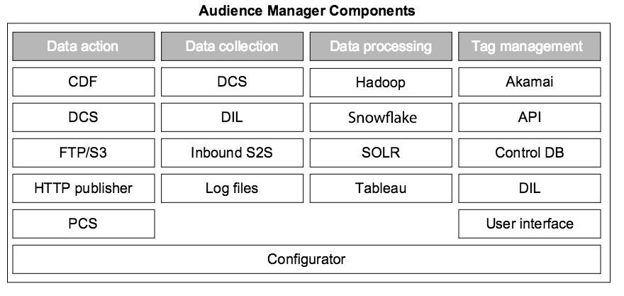

# Schlüsselkomponenten im Audience Manager-System{#key-components-in-the-audience-manager-system}

Audience Manager unterteilt seine Systeme und Prozesse in vier Hauptkategorien: Tag-Management, Datenerfassung, Datenorganisation und Datenaktionsfähigkeit.

<!-- 

c_compstack.xml

 -->

Die folgende Abbildung zeigt die Hauptkomponenten und die zugrunde liegende Technologie (Hardware und Software), die [!DNL Audience Manager] unterstützt. Obwohl einige Prozesse bestimmte Funktionen ausführen und andere multifunktionale Rollen haben, arbeiten alle Systeme zusammen, um Sie bei der Verwaltung von Tags, der Erfassung von Daten, der Leistungsanalyse, der Synchronisierung von Informationen mit anderen Systemen und der Durchführung von Aktionen mit diesen Informationen zu unterstützen.

