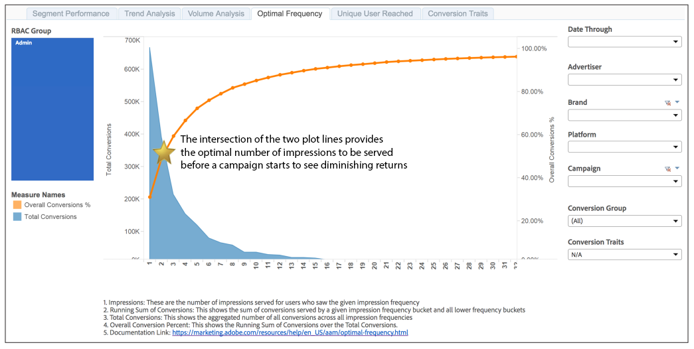

# optimaler Frequenzbericht{#optimal-frequency-report}

Der Bericht Optimale Häufigkeit hilft Ihnen, das optimale Gleichgewicht zwischen der Anzahl der bereitgestellten Impressionen und Konversionen zu ermitteln. Damit können Sie die Anzahl der Impressionen anpassen, die Sie anzeigen möchten, bevor Sie beginnen, abnehmende Rückgaben zu sehen.

Der Bericht hat ein Lookback-Intervall von 30 Tagen ab dem in der [!UICONTROL Date Through] ausgewählten Datum.

Das Konversionsvolumen sinkt typischerweise mit höheren Impression-Frequenz-Buckets. Weniger Benutzer sehen die höhere Anzahl von Impressionen. Das bedeutet, dass die höheren Frequenzbereiche weniger Konversionen aufweisen.

Der Gesamtumsatz % steigt jedoch mit jedem Abformhäufigkeitsbereich. Mit jedem Bucket werden weitere Konversionen generiert, sodass sich die Summe der Konversionen (der Zähler) der Gesamtzahl der möglichen Konversionen (der Nenner) annähert und daher der Prozentsatz steigt.

Wie im Musterbericht gezeigt, liefert die Schnittmenge der zwei Liniendiagramme eine Anleitung für die „optimale“ Impressionshäufigkeit, d. h. die optimale Anzahl der Impressionen, die bedient werden müssen, bevor der Kunde sinkende Renditen zu sehen beginnt.

## Beispielbericht

