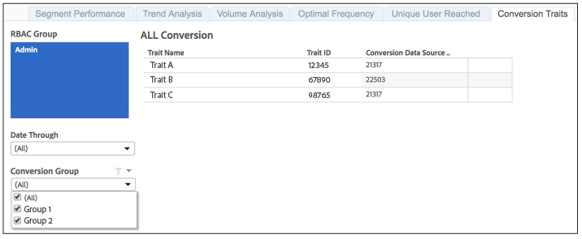

# Gemeldete Konversionseigenschaften{#reported-conversion-traits}

Der Bericht „Konversionseigenschaften“ zeigt alle Eigenschaften an, die zu einem bestimmten Datum als Konversionseigenschaften für eine Konversionsgruppe gekennzeichnet sind.

Konversionseigenschaften für Konversionsgruppen können sich von einer Berichtsausführung zur anderen ändern. Der Bericht zeigt Konversionsmerkmale nach Konversionsgruppe für das ausgewählte Berichtsdatum an.

Informationen zum Erstellen von Konversionseigenschaften in Audience Manager finden Sie im folgenden Video:

>[!VIDEO](https://video.tv.adobe.com/v/328027?captions=ger)

## Beispielbericht

Ihr [!UICONTROL Reported Conversion Traits] könnte in etwa wie der folgende aussehen:

