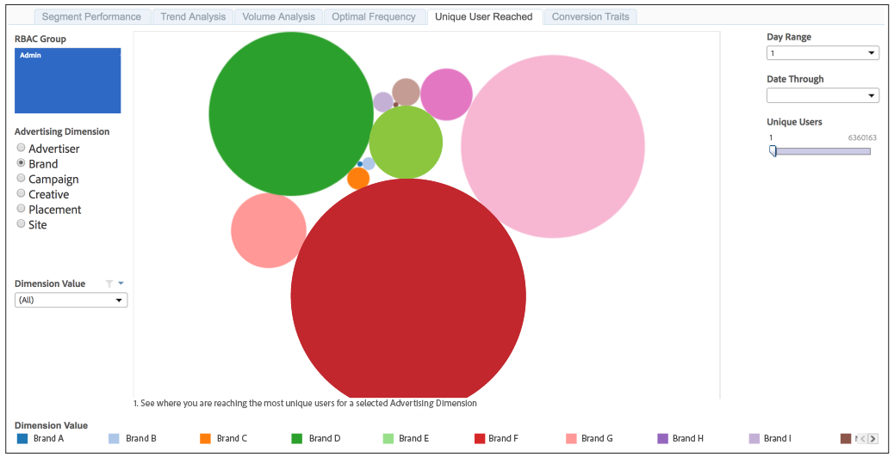

# Unique User Reach{#unique-user-reach}

Der Bericht „Reichweite bei Unique User“ gibt Daten in einem Blasendiagramm zurück. Die Größe jeder Blase hängt direkt von der Anzahl der Unique Users für Ihre ausgewählte Dimension ab. Eine größere Blase zeigt eine größere Reichweite an als eine kleinere.

Der Bericht zur Benutzerreichweite hilft Ihnen, den Advertiser, die Marke, die Kampagne, die Kreativität, die Platzierung oder die Site zu finden, die bzw. die die größte Reichweite für Ihre Zielgruppenbenutzenden bietet.

>[!NOTE]
>
>Bedenken Sie Folgendes:
>
>* Der [!UICONTROL Unique User Reach]-Bericht zeigt Informationen nur für Benutzer mit [!UICONTROL Admin] Berechtigungsebenen an. Ihr [!DNL Audience Manager] oder die Kundenunterstützung kann Ihrem Konto [!UICONTROL Admin] Berechtigungen erteilen.
>
>* 7-tägige und 30-tägige Lookback-Perioden sind nur für Sonntag verfügbar.

## Beispielbericht

Ihr [!UICONTROL Unique User Reach] könnte in etwa wie der unten stehende aussehen. Klicken Sie in Ihrem Bericht auf eine Blase, um die zugrunde liegenden Daten anzuzeigen.

