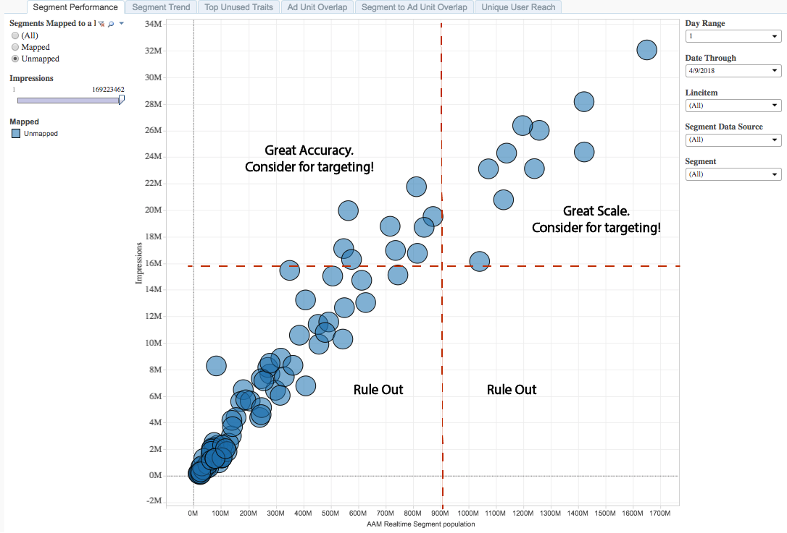

# Bericht zur Segmentleistung{#segment-performance-report}

Der Segmentleistungsbericht vergleicht zugeordnete und nicht zugeordnete Segmente nach Impressionen und Echtzeit-Segmentindividualitäten.

Ein zugeordnete Segment ist ein Segment, das Sie erstellen und zum Targeting an ein Ziel senden. Ein nicht zugeordnete Segment ist ein Segment, das Sie erstellt haben, das jedoch nicht zum Targeting an ein Ziel gesendet wurde.

Durch den Vergleich dieser verschiedenen Segmenttypen innerhalb und zwischen Berichten können Sie vorhandene Kampagnen optimieren und übersehene Segmente finden, die Sie zum Targeting an ein Ziel senden möchten.

## Nutzungsszenarios {#use-cases}

Mit dem Bericht [!UICONTROL Segment Performance] können Sie:

* Identifizieren Sie zugeordnete Audiencen, die Skalierungs- oder Leistungssteigerungen bewirken.
* Identifizieren Sie nicht zugeordnete Segmente, die Sie in zukünftigen Kampagnen einführen möchten, basierend auf dem Beitrag einer Audience zur Performance in der Vergangenheit.

## Verwenden des Segmentleistungsberichts {#using-segment-performance-report}

Wechsel zwischen **[!UICONTROL Mapped]** und **[!UICONTROL Unmapped]**, um Segmente auszuwählen, die einem Ziel zugeordnet sind oder nicht. Wählen Sie **[!UICONTROL All]** aus, um alle Segmente in den Bericht einzubeziehen.

Mit den Steuerelementen **Zeitraum** und **Datum bis** können Sie Ihren Lookback-Bereich anpassen. Beachten Sie, dass die 7- und 30-Tage-Rückblickzeit nur für Sonntagsdaten verfügbar ist.

Verwenden Sie das Dropdownfeld **[!UICONTROL Line Item]**, um die Webeigenschaften auszuwählen, für die Sie Informationen zurückgeben möchten.

Wählen Sie im Dropdownfeld **[!UICONTROL Segment Data Source]** die Datenquellen mit den Segmenten aus, die Sie im Bericht sehen möchten.

Verwenden Sie das Dropdownfeld **[!UICONTROL Segment]**, um auszuwählen, welche Segmente Sie im Bericht sehen möchten.

>[!IMPORTANT]
>
>Wenn Sie [!UICONTROL Audience Optimization for Publishers] aktivieren, müssen Sie beschreibende Metadaten für [!UICONTROL Line Item IDs] einfügen, wie in Schritt 3 von [Google Ad Manager (ehemals DFP)-Datendateien in Audience Manager](../../../reporting/audience-optimization-reports/aor-publishers/import-dfp.md) beschrieben. Auf diese Weise stellen Sie sicher, dass der Bericht die Webeigenschaft als [!UICONTROL Line Item] und nicht als [!UICONTROL Line Item ID] bezeichnet.

## Interpretieren der Ergebnisse {#interpreting-results}

Ihr [!UICONTROL Segment Performance]-Bericht könnte ähnlich wie der unten stehende aussehen. Klicken Sie in Ihrem Bericht auf einen Punkt, um die zugrunde liegenden Daten Ansicht. Siehe Beschreibungen der zusätzlichen Informationen in der Tabelle unter dem Beispielbericht.

<table id="table_AFE2540583C34835B04584693ADFD26A"> 
 <thead> 
  <tr> 
   <th colname="col1" class="entry"> Element </th> 
   <th colname="col2" class="entry"> Beschreibung </th> 
  </tr>
 </thead>
 <tbody> 
  <tr> 
   <td colname="col1"> 
Segment 
 </td> 
   <td colname="col2"> 
Der alphanumerische Name, den Sie diesem Segment zugewiesen haben. 
 </td> 
  </tr> 
  <tr> 
   <td colname="col1"> 
Segment-ID 
 </td> 
   <td colname="col2"> 
Die eindeutige ID dieses Segments. 
 </td> 
  </tr> 
  <tr> 
   <td colname="col1"> 
Linienelement 
 </td> 
   <td colname="col2"> 
Die Webeigenschaft, für die Sie diesen Bericht sehen. 
 </td> 
  </tr> 
  <tr> 
   <td colname="col1"> 
Klicks 
 </td> 
   <td colname="col2"> 
Die Häufigkeit, mit der Mitglieder dieser Eigenschaft auf Elemente in Ihrer Webeigenschaft geklickt haben. 
 </td> 
  </tr> 
  <tr> 
   <td colname="col1"> 
Eindrücke 
 </td> 
   <td colname="col2"> 
Die Häufigkeit, mit der Mitglieder dieser Eigenschaft Ihrem Bestand ausgesetzt wurden. 
 </td> 
  </tr> 
  <tr> 
   <td colname="col1"> 
CTR 
 </td> 
   <td colname="col2"> 
Clickthrough-Rate. 
 
Diese Metrik gibt den Prozentsatz der Impressionen, gefolgt von Klicks, wieder. Dividieren Sie Klicks durch Impressionen, um diese Metrik zu erhalten. 
 </td> 
  </tr> 
  <tr> 
   <td colname="col1"> 
Population von Echtzeit-Segmenten 
 </td> 
   <td colname="col2"> 
Die tatsächliche Anzahl individueller Besucher, die in Echtzeit für den angegebenen Zeitraum gesehen wurden und die zum Zeitpunkt, zu dem sie von  Audience Manager gesehen wurden, für das Segment qualifiziert waren. 
 </td> 
  </tr> 
 </tbody> 
</table>

## Lesen der zugeordneten Segmentergebnisse {#read-mapped-segment}

Die Position der zugeordneten Segmente in einem Bericht kann Ihnen sehr gut erklären, welche Segmente gut abschneiden und wo Sie eventuell Anpassungen vornehmen müssen.

Zum Lesen des Berichts ist es hilfreich, die Ergebnisse in vier Abschnitte mit imaginären Zeilen (in Rot) und den Kategorien im Beispielbericht unten aufzuteilen. Die Beschriftungen im Beispiel können Ihnen dabei helfen, die Segmentleistung und die Reaktion auf diese Ergebnisse zu verstehen.

## Lesen der nicht zugeordneten Segmentergebnisse {#read-unmapped-segment}

Wenn Sie sich nicht zugeordnete Segmente in einem [!UICONTROL Segment Performance]-Bericht ansehen, können Sie auf diese Weise neue Segmente finden, die Sie für das Targeting nicht berücksichtigt haben. Tatsächlich können einige dieser Segmente Ihre zugeordneten Segmente übertreffen.

Zum Lesen dieses Berichts ist es hilfreich, die Ergebnisse in vier Abschnitte mit imaginären Zeilen (in Rot) und Kategorien zu unterteilen, die im folgenden Beispielbericht dargestellt werden.

