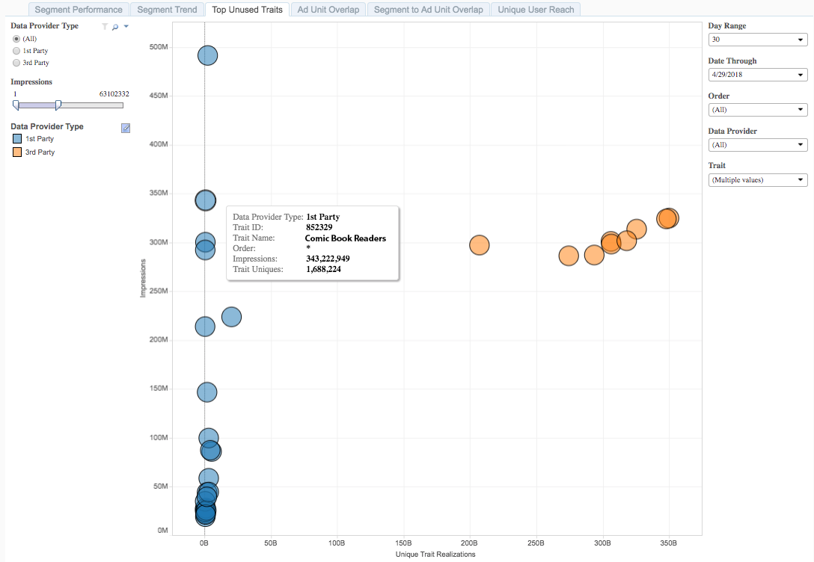

# Häufigste nicht verwendete Eigenschaften{#top-unused-traits}

Die wichtigsten nicht verwendeten Eigenschaften werden als Streudiagramm von Eigenschaften dargestellt, die noch nicht Mitglieder eines Segments sind, basierend auf dem Eigenschaftstyp, der Datenquelle und der Leistung.

## Anwendungsfall {#use-cases}

Mit dem Bericht [!UICONTROL Top Unused Traits] können Sie die Leistung von Erstanbieter- und Drittanbietereigenschaften analysieren und vergleichen, die derzeit keinem Segment zugeordnet sind. Diese Ansicht kann die besten Eigenschaften hervorheben, die in einem Zielgruppensegment zur Kampagnenoptimierung oder zu neuen Chancen verwendet werden können.

## Verwenden des Berichts &quot;Häufigste nicht verwendete Eigenschaften&quot; {#using-the-report}

Verwenden Sie die **[!UICONTROL Data Provider Type]** -Steuerelemente, um zwischen Erstanbieter- und Drittanbieter-Eigenschaften umzuschalten. Wählen Sie **[!UICONTROL All]** aus, um Erstanbieter- und Drittanbieter-Eigenschaften im Bericht zurückzugeben.

Mit dem Schieberegler **[!UICONTROL Impressions]** können Sie einen Mindest- und einen Höchstwert für zurückgegebene Impressionen auswählen. Eigenschaften, die für weniger oder mehr als die von Ihnen festgelegten Beschränkungen verantwortlich sind, werden nicht im Bericht angezeigt.

Verwenden Sie die Steuerelemente **[!UICONTROL Day Range]** und **[!UICONTROL Date Through]** , um Ihren Rückblickbereich anzupassen. Beachten Sie, dass für diesen Bericht nur der 30-Tage-Rückblickzeitraum verfügbar ist.

Verwenden Sie das Dropdown-Feld &quot;**[!UICONTROL Order]**&quot;, um die Webeigenschaften in Ihrem Portfolio auszuwählen, für die Sie Informationen zurückgeben möchten.

Wählen Sie in der Dropdown-Liste **[!UICONTROL Data Provider]** die Datenquellen aus, die die Eigenschaften enthalten, die Sie im Bericht sehen möchten.

Wählen Sie über das Dropdownfeld **[!UICONTROL Traits]** aus, welche Eigenschaften im Bericht angezeigt werden sollen.

>[!IMPORTANT]
>
>Beim Aktivieren von [!UICONTROL Audience Optimization for Publishers] müssen Sie beschreibende Metadaten für [!UICONTROL Order IDs] einfügen, wie in Schritt 3 von [Importieren von Google Ad Manager-Datendateien (ehemals DFP) in Audience Manager](../../../reporting/audience-optimization-reports/aor-publishers/import-dfp.md) beschrieben. Dadurch stellen Sie sicher, dass der Bericht die Webeigenschaft als [!UICONTROL Order] anstelle von [!UICONTROL Order ID] detailliert beschreibt.

## Interpretieren der Ergebnisse {#interpreting-results}

**Beispielbericht**

Ihr [!UICONTROL Top Unused Traits] -Bericht könnte dem unten stehenden ähneln. Klicken Sie in Ihrem Bericht auf eine Blase, um die zugrunde liegenden Daten anzuzeigen.

Weitere Informationen finden Sie in der Tabelle unter dem Beispielbericht.

<table id="table_AFE2540583C34835B04584693ADFD26A"> 
 <thead> 
  <tr> 
   <th colname="col1" class="entry"> Element </th> 
   <th colname="col2" class="entry"> Beschreibung </th> 
  </tr>
 </thead>
 <tbody> 
  <tr> 
   <td colname="col1"> 
 Datenanbietertyp 
 </td> 
   <td colname="col2"> 
Gibt an, ob die ausgewählte Datenquelle Erstanbieter- oder Drittanbieter-Eigenschaften enthält. 
 </td> 
  </tr> 
  <tr> 
   <td colname="col1"> 
 Eigenschafts-ID 
 </td> 
   <td colname="col2"> 
Die eindeutige ID dieser Eigenschaft. 
 </td> 
  </tr> 
  <tr> 
   <td colname="col1"> 
 Eigenschaftsname 
 </td> 
   <td colname="col2"> 
Der alphanumerische Name, den Sie oder der Datenanbieter dieser Eigenschaft zugewiesen haben. 
 </td> 
  </tr> 
  <tr> 
   <td colname="col1"> 
 Bestellung 
 </td> 
   <td colname="col2"> 
Die Webeigenschaft, für die dieser Bericht angezeigt wird. 
 </td> 
  </tr> 
  <tr> 
   <td colname="col1"> 
 Impressionen 
 </td> 
   <td colname="col2"> 
Die Häufigkeit, mit der Mitglieder dieser Eigenschaft Ihrem Inventar ausgesetzt wurden. 
 </td> 
  </tr> 
  <tr> 
   <td colname="col1"> 
 Eindeutige Eigenschaften 
 </td> 
   <td colname="col2"> 
Die Anzahl der Eigenschaftsmitglieder innerhalb der letzten 30 Tage. 
 </td> 
  </tr> 
 </tbody> 
</table>

Die Position Ihrer Eigenschaften in einem Bericht kann Ihnen viel darüber vermitteln, welche Eigenschaften Sie zur Optimierung vorhandener Zielgruppensegmente verwenden können.

Die Eigenschaften, die höher auf der Impressionsachse liegen, sind diejenigen, die Sie in Ihren Kampagnen verwenden möchten. Bei Eigenschaften mit einer geringen Anzahl von Impressionen ist es unwahrscheinlich, dass Sie diese Zielgruppe basierend auf Ihren [!DNL Google Ad Manager] -Daten in Ihrer Webeigenschaft erreichen.

Suchen Sie nach links von der [!UICONTROL Unique Trait Realizations]-Achse nach hochpräzisen Eigenschaften und nach rechts nach Eigenschaften, die die Skalierung fördern können.

<table id="table_A29253B30DFA4CD7B3B7C320DE0BDEA4"> 
 <thead> 
  <tr> 
   <th colname="col1" class="entry"> Position </th> 
   <th colname="col2" class="entry"> Platzierungsangaben </th> 
  </tr> 
 </thead>
 <tbody> 
  <tr> 
   <td colname="col1"> 
 <b>Oben links</b> 
 </td> 
   <td colname="col2"> 
Hohe Anzahl von Impressionen, geringe Anzahl von Realisierungen von Eigenschaften. 
 
Dies ist eine hochgenaue Zielgruppe, die noch nicht Mitglied eines Segments ist. Erwägen Sie Targeting. 
 </td> 
  </tr> 
  <tr> 
   <td colname="col1"> 
 <b>Unten links</b> 
 </td> 
   <td colname="col2"> 
Geringe Anzahl von Impressionen, geringe Anzahl von Realisierungen von Eigenschaften. 
 
 Lassen Sie diese Eigenschaften außer Kraft, da die Mitglieder nicht zu Impressionen in Ihren Web-Eigenschaften beitragen. 
 </td> 
  </tr> 
  <tr> 
   <td colname="col1"> 
 <b>Oben rechts</b> 
 </td> 
   <td colname="col2"> 
Hohe Anzahl von Impressionen, hohe Anzahl von Realisierungen von Eigenschaften. 
 
Hohe Reichweite gegenüber einer Zielgruppe, die noch nicht in einem Segment angezeigt wird. Diese Zielgruppe ist aufgrund der hohen Anzahl von Impressionen und der Skala ein Hauptkandidat für das Targeting. 
 </td> 
  </tr> 
  <tr> 
   <td colname="col1"> 
 <b>Unten rechts</b> 
 </td> 
   <td colname="col2"> 
Geringe Anzahl von Impressionen, hohe Anzahl von Realisierungen von Eigenschaften. 
 
 Sie können diese Eigenschaften ausschließen, da die Mitglieder nicht zu Impressionen in Ihren Webeigenschaften beitragen. 
 </td> 
  </tr> 
 </tbody> 
</table>
