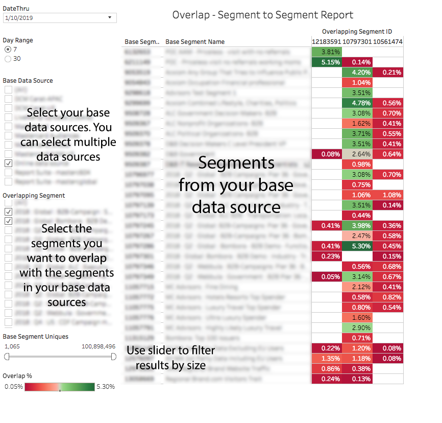

# Überlagerungsbericht zwischen Segmenten{#segment-to-segment-overlap-report}

Gibt Daten darüber zurück, wie viele Unique Users für Ihre Segmente freigegeben wurden.

>[!NOTE]
>
>Die Überschneidungsberichte in Audience Manager folgen den RBAC-Grundsätzen. Sie können nur Segmente aus Datenquellen sehen, auf die Sie Zugriff haben, basierend auf der [RBAC-Benutzergruppe](/help/using/features/administration/administration-overview.md), zu der Sie gehören.

<!-- 

c_segment_segment_overlap.xml

 -->

## Überblick

Der Bericht [!UICONTROL Segment-to-Segment Overlap] kann Ihnen dabei helfen,

* Identifizieren Sie Segmente mit hoher oder niedriger Überschneidung, je nach Ihren Anforderungen. Eigenschaften mit hoher Überschneidung geben Ihnen eine zielgerichtete Audience, aber weniger individuelle Besucher. Eigenschaften mit geringer Überschneidung können nützlich sein, um einen größeren, eindeutigen Besucher zu erreichen.
* Finden Sie unerwartete Überschneidungen und verwenden Sie diese Informationen, um neue, leistungsstarke Segmente zu erstellen.

## Beispielbericht

In der folgenden Abbildung wird ein Überblick über den [!UICONTROL Segment-to-Segment Overlap]-Bericht auf hoher Ebene gegeben.

>[!NOTE]
>
>Der Bericht [!UICONTROL Segment-to-Segment Overlap] gibt ein leeres Feld zurück, wenn dasselbe Segment mit sich selbst verglichen wird.

## Drilldown für einzelne Datenpunkte

Wählen Sie in einem Popup-Fenster einen individuellen Punkt für die Datendetails der Ansicht aus. Durch Ihre Klickaktionen werden die im Bericht angezeigten Daten automatisch aktualisiert.

## Daten-Popupffelder, die für {#fields-defined} definiert wurden, von Segment zu Segment überlagern

<!-- 

r_s2s_data_pop.xml

 -->

Das Popup für den [!UICONTROL Segment-to-Segment Overlap]-Bericht enthält die folgenden Metriken. Beachten Sie, dass die Metrik &quot;Individuelle Werte&quot;in der Tabelle Ihre *Echtzeit-Benutzer* darstellt.

| Metrik | Beschreibung |
|---|---|
| **[!UICONTROL Base Segment ID]** | Eindeutige numerische ID für das Segment, das in den Berichtsergebnissen angezeigt wird. Erscheint als Zeilen-ID für das Segment. |
| **[!UICONTROL Base Segment Name]** | Name des Segments, das in der Berichtsergebniszeile angezeigt wird. |
| **[!UICONTROL Overlapping Segment ID]** | Eindeutige numerische ID für das Segment, das Sie beim Ausführen des Berichts auswählen. Erscheint als Spalte-ID für das Segment. |
| **[!UICONTROL Overlapping Segment Name]** | Name des Segments, das Sie beim Ausführen des Berichts auswählen. Erscheint in der Berichtsergebnisspalte. |
| **[!UICONTROL Base Segment Uniques]** | Die Anzahl der individuellen Besucher in Ihrem Basissegment. |
| **[!UICONTROL Base Segment Uniques]** | Die Anzahl der individuellen Besucher im sich überschneidenden Segment. |
| **[!UICONTROL Overlapping Uniques]** | Die Anzahl der eindeutigen Besucher, die zwischen den Vergleichssegmenten freigegeben wurden. |
| **[!UICONTROL Overlap %]** | Um die Überschneidung in % zu erhalten, verwendet Audience Manager die folgende Formel: Überschneidende individuelle Elemente / (Basis-Segment-Uniques + Überschneidende Segment-Uniques - Überschneidende Uniques) |

>[!MORELIKETHIS]
>
>* [Filtern von Berichtsergebnissen mit den Datenreglern](../../reporting/dynamic-reports/data-sliders.md)
>* [In interaktiven Berichten verwendete Formen, Farben und Größen](../../reporting/dynamic-reports/interactive-report-technology.md#shapes-colors-sizes)
>* [Berichtssymbole und -werkzeuge erläutert](../../reporting/dynamic-reports/interactive-report-technology.md#icons-tools-explained)
>* [Überlagerungsberichte: Aktualisierungszeitplan und Mindestsegmentgröße](../../reporting/dynamic-reports/overlap-minimum-segment-size.md)
>* [Daten-Sampling und Fehlerraten in ausgewählten Audience Manager-Berichten...](../../reporting/report-sampling.md)
>* [CSV-Dateien für Überlagerungsberichte](../../reporting/dynamic-reports/overlap-csv-files.md)

