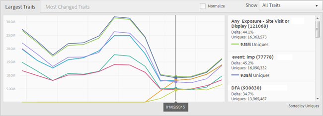

# Berichte-Dashboard {#reports-dashboard}

Verwenden Sie das Dashboard zur Ansicht von Informationen zu den Zahlen Ihrer individuellen Besucher, aufgeschlüsselt nach Eigenschaftsarten und Segmenten, für einen bestimmten Zeitraum.

<!-- 

c_dashboard.xml

 -->

[!DNL Audience Manager] verwendet  [!UICONTROL Role Based Access Control] ([!UICONTROL RBAC]), um Benutzergruppenberechtigungen auf die  [!UICONTROL Dashboard]zu erweitern. Benutzer können nur Informationen zu dem Dashboard anzeigen, für das sie über die Berechtigung zur Ansicht verfügen. [!UICONTROL RBAC] Mit dieser Funktion können Sie steuern, welche Berichte-Daten interne Teams zur Ansicht bereitstellen können.

Eine Agentur, die verschiedene Advertiser-Konten verwaltet, kann beispielsweise Benutzergruppenberechtigungen so konfigurieren, dass ein Team, das das Konto des Advertiser A verwaltet, die Daten des Berichte von Advertiser B nicht sehen kann. Dieses Dashboard kann zur Fehlerbehebung bei Problemen mit dem Data-Versand verwendet werden.

Wenn Sie z. B. einen Tiefpunkt oder eine Spitze bei Unique Users mit der Unterteilung des Typs Unique User (regelbasiert im Vergleich zu eingebettet) bemerken, haben Sie einen besseren Ausgangspunkt, um ein potenzielles Data-Versand-Problem zu verfolgen. Wenn Sie einen Tiefpunkt bei den Unique Users und bei den eingebetteten Unique Users feststellen, können Sie zum Bericht [!UICONTROL On-boarding Status] wechseln, um zu sehen, ob ein Problem mit einer eingehenden Datei aufgetreten ist.

**So greifen Sie auf das Dashboard zu:**

1. Klicken Sie im oberen Navigationsmenü auf **[!UICONTROL Dashboard]**.
2. *Optional:* Wählen Sie den gewünschten Zeitraum ab dem Datum des letzten Berichte aus der Dropdown-Liste (7 Tage, 14 Tage (Standard), 30 Tage oder 60 Tage).

   Je nach ausgewähltem Zeitraum zeigt die Deltaänderung in den Feldern [!UICONTROL Largest Traits] > [!UICONTROL Most Changed Traits] und [!UICONTROL Largest Segments] > [!UICONTROL Most Changed Segments] die Veränderung der individuellen Besucher in der Audience im Zeitraum, der heute endet, im Vergleich zum vorherigen Zeitraum derselben Länge an. Wenn Sie z. B. &quot;7 Tage&quot;auswählen, vergleicht das Delta die individuellen Besucher der letzten sieben Tage mit den eindeutigen Besuchern der letzten sieben Tage.

   >[!NOTE]
   >
   >Sie können eine Delta-Änderung untersuchen, die ungewöhnlich erscheint, indem Sie einen [!UICONTROL Trend]-Bericht ausführen. Wenn Sie z. B. in den letzten sieben Tagen eine ungewöhnlich große Delta-Änderung sehen, können Sie einen [!UICONTROL Trend]-Bericht für die letzten 14 Tage (2 x 7) ausführen, um die Zahlen besser zu verstehen.

   Je nach den Berechtigungen des angemeldeten Benutzers werden die folgenden Bereiche angezeigt:

   * [Partner Uniques](../reporting/reports-dashboard.md#partner-uniques)
   * [Größte Eigenschaften/am meisten geänderte Eigenschaften](../reporting/reports-dashboard.md#largest-traits)
   * [Größte Segmente/Am meisten geänderte Segmente](../reporting/reports-dashboard.md#most-changed-segments)

3. ** OptionalKlicken Sie  **[!UICONTROL Normalize]** über einem Diagramm, um alle Daten auf derselben Skala anzuzeigen. Sie können den Mauszeiger auch über einen Datenpunkt bewegen, um weitere Informationen anzuzeigen.

## Partner-Uniques {#partner-uniques}

Berechtigung erforderlich für Ansicht: [!UICONTROL View All Traits].

In diesem Bereich wird die Anzahl der individuellen Besucher während des angegebenen Zeitraums angezeigt. Die einzelnen farbkodierten Zeilen stellen die Gesamtzahl der individuellen Besucher und die Anzahl der individuellen Besucher dar, die mit algorithmischen, regelbasierten und integrierten Eigenschaften erfasst werden.

>[!NOTE]
>
>Die Gesamtanzahl der individuellen Besucher stellt Besucher dar, die über regelbasierte oder nicht integrierte Eigenschaften erfasst werden. Die Gesamtanzahl der individuellen Besucher entspricht jedoch nicht der Summe der individuellen Besucher, die mit den regelbasierten und integrierten Eigenschaften erfasst wurden. Derselbe eindeutige Benutzer kann in einem dieser beiden Eigenschaftstypen dargestellt werden.

## Größte Eigenschaften/am meisten geänderte Eigenschaften {#largest-traits}

Berechtigung erforderlich für Ansicht: [!UICONTROL View Traits].

In diesem Bedienfeld wird die Anzahl der individuellen Besucher angezeigt, die von verschiedenen Eigenschaften erfasst werden.

Verwenden Sie die Dropdown-Liste **[!UICONTROL Show]**, um Informationen zu verschiedenen Typen von Eigenschaften anzuzeigen: [!UICONTROL All Traits], [!UICONTROL Algorithmic], [!UICONTROL Onboarded] oder [!UICONTROL Rule-Based].

Dieses Bedienfeld enthält die folgenden Registerkarten:

<table id="table_DA48BDEB4E0143BEA4EB85AC26FF6AE3"> 
 <thead> 
  <tr> 
   <th colname="col1" class="entry"> Tab </th> 
   <th colname="col2" class="entry"> Beschreibung </th> 
  </tr> 
 </thead>
 <tbody> 
  <tr> 
   <td colname="col1"> 
 Größte Eigenschaften 
 </td> 
   <td colname="col2"> 
Zeigt Informationen über die Anzahl der individuellen Besucher sortiert nach Anzahl (am höchsten bis am niedrigsten) sowie Listen der Delta-Änderung individueller Besucher während des angegebenen Zeitraums an. 
 </td> 
  </tr> 
  <tr> 
   <td colname="col1"> 
 Am meisten geänderte Eigenschaften 
 </td> 
   <td colname="col2"> 
Zeigt Informationen über die Anzahl der individuellen Besucher nach der Delta-Änderung sortiert an. 
 </td> 
  </tr> 
 </tbody> 
</table>

## Größte Segmente/Am meisten geänderte Segmente {#most-changed-segments}

Berechtigung erforderlich für Ansicht: [!UICONTROL View Segments].

In diesem Bedienfeld wird die Anzahl der individuellen Besucher angezeigt, die von verschiedenen Segmenten in Echtzeit erfasst werden.

Dieses Bedienfeld enthält die folgenden Registerkarten:

<table id="table_8E22E0579FA74C5A86CC40B40B2548BE"> 
 <thead> 
  <tr> 
   <th colname="col1" class="entry"> Registerkarte </th> 
   <th colname="col2" class="entry"> Beschreibung </th> 
  </tr> 
 </thead>
 <tbody> 
  <tr> 
   <td colname="col1"> 
 Größte Segmente 
 </td> 
   <td colname="col2"> 
Zeigt Informationen zur Anzahl der individuellen Besucher und zur Delta-Änderung individueller Besucher während des angegebenen Zeitraums an. 
 </td> 
  </tr> 
  <tr> 
   <td colname="col1"> 
 Am häufigsten geänderte Segmente 
 </td> 
   <td colname="col2"> 
Zeigt Informationen über die Anzahl der individuellen Besucher nach der Delta-Änderung sortiert an. 
 </td> 
  </tr> 
 </tbody> 
</table>

