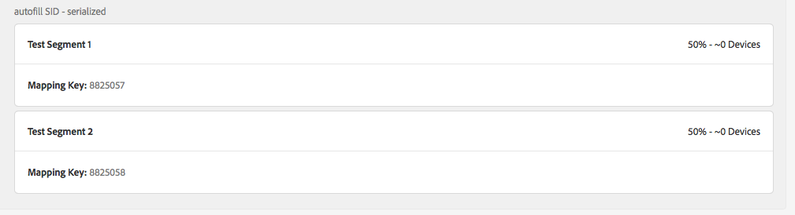

# Sollte ich meine von Audience Lab zugeordneten Segmente auf der Zieldetailseite sehen? {#audience-lab-segments-destination-page}

## Frage

Ich habe in [!UICONTROL Audience Lab]einige Testsegmente erstellt und sie einem Ziel zugeordnet. Wenn ich sie jedoch auf der Seite mit den Zieldetails suche, werden sie nicht angezeigt.

Wird dieses Verhalten erwartet, oder handelt es sich um einen Fehler?

## Antwort

Zugeordnete Segmente, die in [!UICONTROL Audience Lab] erstellt werden, werden nicht auf der Seite mit den Zieldetails angezeigt.

In den untenstehenden Screenshots werden beispielsweise [!UICONTROL Test Segment 1] und [!UICONTROL Test Segment 2] dem Ziel [!UICONTROL autofill SID - serialized] zugeordnet.

Die Segmente tauchen im Segmenttest in Audience Lab auf:

Die Segmente werden jedoch nicht auf der Seite mit den Zieldetails angezeigt:

