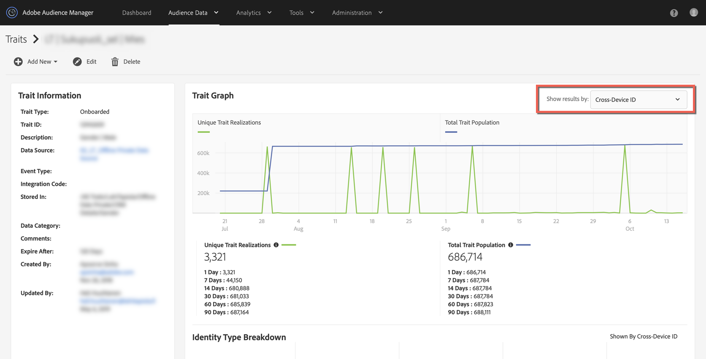

# Warum sind meine integrierten Eigenschaftspopulationen um den 15. Oktober auf 0 zurückgegangen? {#why-did-my-onboarded-trait-populations-drop-to-0-around-october}

## Frage

Um den 14. Oktober 2019 herum bemerkte ich, dass meine integrierten Eigenschaftspopulationen für das Geräte-ID-Diagramm auf 0 gefallen sind, obwohl sie zuvor viel höher waren. Warum ist das passiert?

## Antwort

Am 15. Oktober wurde die Funktionalität der Profilzusammenführungsrichtlinien von Audience Manager durch eine Aktualisierung dahingehend geändert, dass integrierte Daten, die von einer CRM-ID eingegeben wurden, die in eine geräteübergreifende Datenquelle hochgeladen wurde, nicht mehr mit Geräte-IDs realisiert werden.  Bisher wurde Audience Manager sowohl für die geräteübergreifende ID (oder CRM-ID) als auch für das Kopieren dieser Realisierungen in die zugehörigen Audience Manager UUIDs (Geräte-IDs) implementiert.  Die Änderung wurde vorgenommen, um die Art der Eigenschaftsdaten und der realisierten Profile genauer widerzuspiegeln.

Zur Ansicht der Eigenschaftsrealisierungen wählen Sie bitte die Option „Cross-Device ID“ aus der Dropdown-Liste oben rechts in der Ansicht „Trait“ aus.

